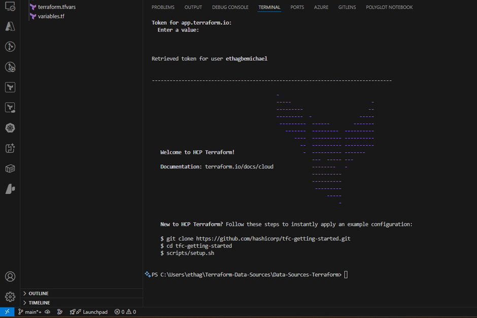
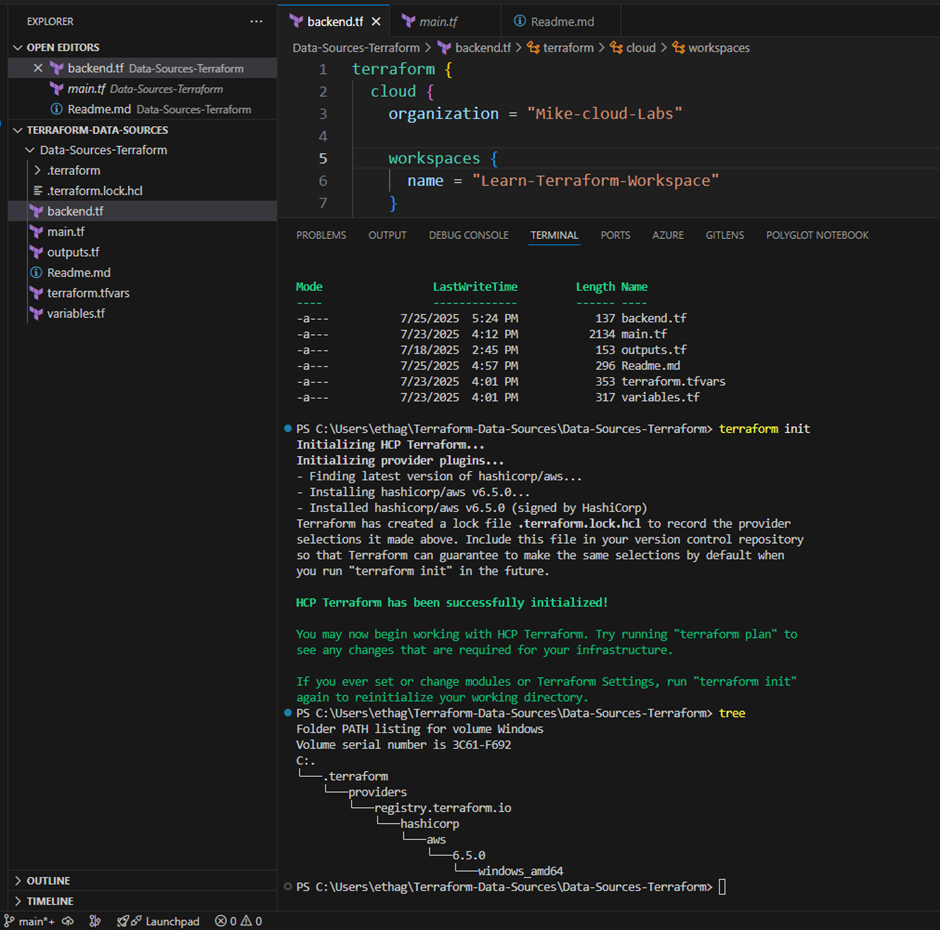
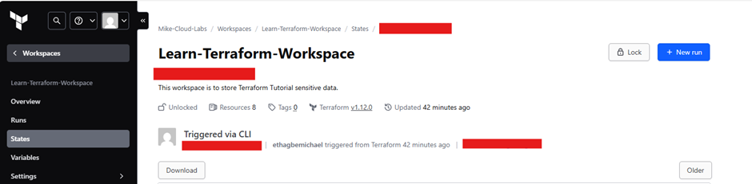
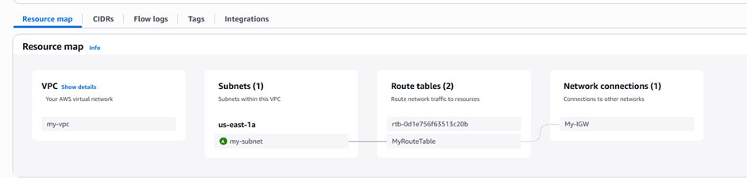

# This is to demonstrate the implementation of Instance Data Source using Terraform, and also integrating Terraform Cloud as a remote backend for State File Storage.

- Explore the repo and let me know your thoughts.
- Custom VPC with the associated components
- EC2 Instance Data Source block
- An EC2 Instance referencing the ami data source ID

# Authenticate to Terraform cloud 

- To successfully implement terraform cloud remote backend, make sure you have terraform workspace already created in your HCP terraform account in your organization
- run terraform login from cli
- generate a token
- add the token to the cli
- see screen result...

- 

# Declare the variables before apply this code, Alternatively, use: terraform apply -var-file="terraform.tfvars" but you're going to get "Value for undeclear variable Warning"

- Checkout the end result screenshots

- 

- 

- 
