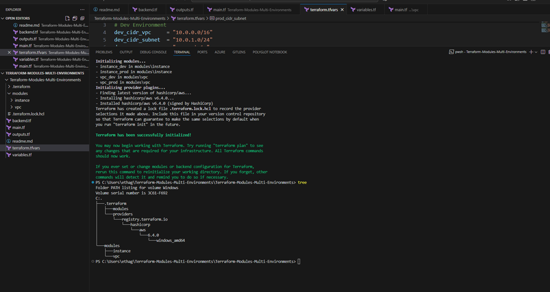
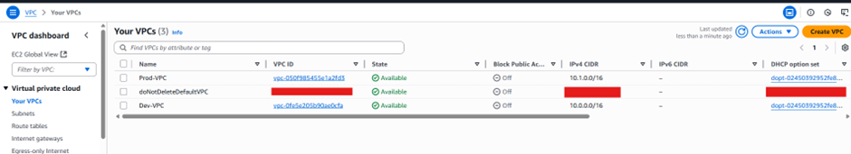
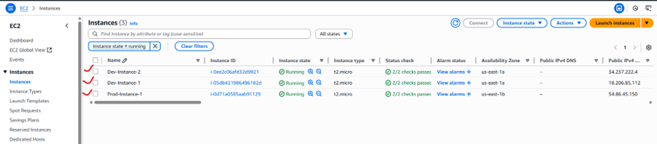
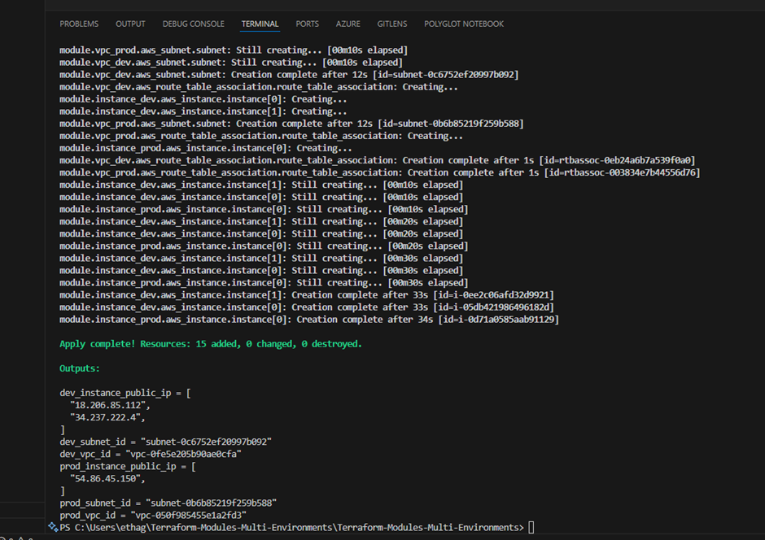

# This demonstrate core infrastructure provisioning in Multi-Environments via AWS using Terraform.

- Screenshot confirmation

# Best Practices for Terraform Modules

1. Use Modules for Reusable Infrastructure: Break down your infrastructure into reusable 
modules. e.g, create separate modules for VPC, EC2 instances, databases, etc. 

2. Version Your Modules: If you're using modules from version control or the Terraform 
Registry, always specify the module version to avoid breaking changes. 

3. Modularize Your Projects: Organize your project into separate modules for easier 
maintenance. e.g, you can have a module for networking, another for compute 
resources, and a third for monitoring. 

4. Document Your Modules: Provide clear documentation for the inputs, outputs, and purpose 
of each module. This helps other team members understand how to use the modules 
correctly. 

# Feel free to tweak it.