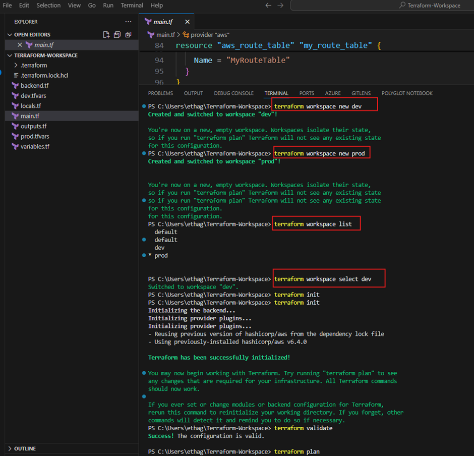
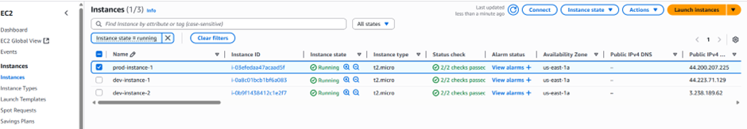
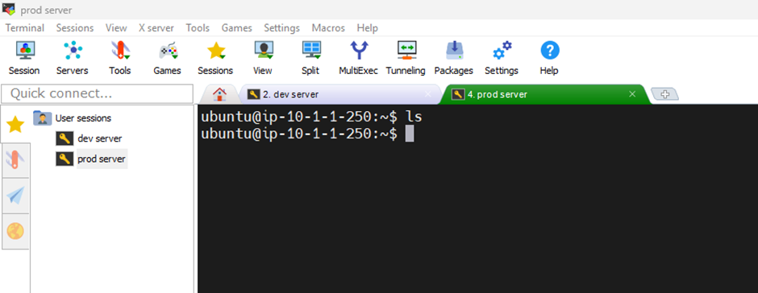
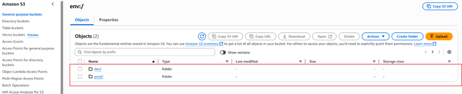

# To demonstrate Terraform workspace using two environments (dev and prod), 

1. Two environments: dev and prod
2. Remote backend configured to store the state files using an AWS S3 bucket and locked it with DynamoDB with encryption set to true.
3. Create two terraform workspace using:
- terraform workspace new dev          # For dev environment
- terraform workspace new prod         # For prod environment
- To apply, please select the appropriate environment, initialize, validate, plan and apply.

# Apply the Terraform code; see screenshot below.

